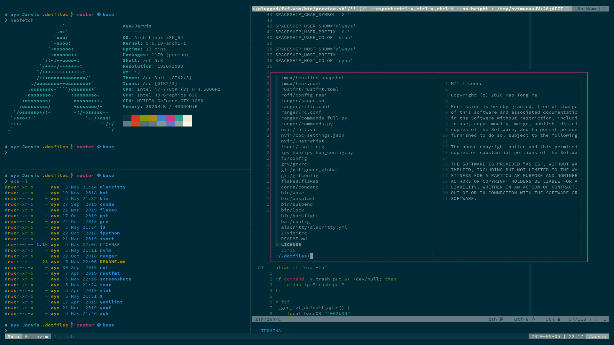
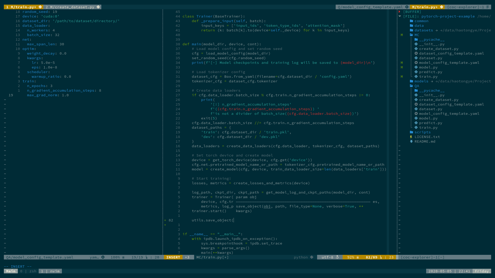
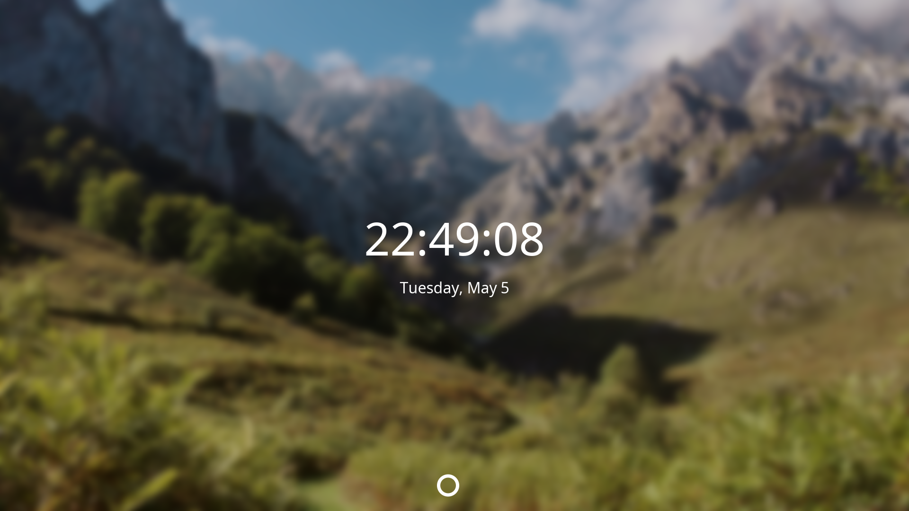

# dotfiles

## Overview
- Terminal emulator: [Alacritty](https://github.com/alacritty/alacritty)
- Shell: [Zsh](https://www.zsh.org/)/[Oh My Zsh](https://ohmyz.sh/)
- Terminal multiplexer: [tmux](https://github.com/tmux/tmux/wiki)
- Editor: [neovim](https://neovim.io/)
- Color scheme: [Solarized Dark](https://ethanschoonover.com/solarized/)

## Neovim

The config file can be found [here](nvim)

## Lock Screen

### Requirements
- [i3lock-color](https://github.com/Raymo111/i3lock-color)
- [jq](https://stedolan.github.io/jq/)

The shell script can be found [here](bin/lock). Every time the screen is locked, a
random photo from [Unsplash](https://unsplash.com/) will be set as the background image.
